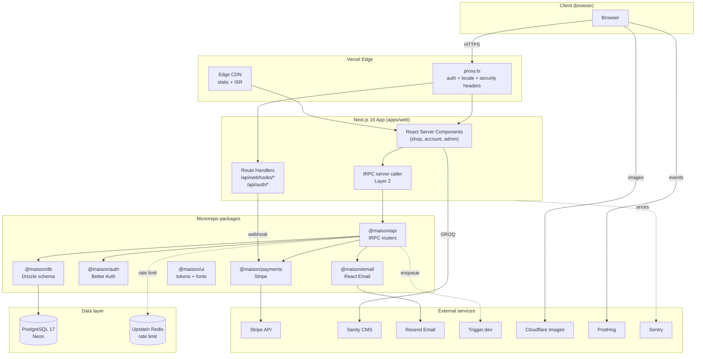

# Maison

[](https://nodejs.org/)
[](https://pnpm.io/)
[](https://nextjs.org/)
[](https://react.dev/)
[](https://www.typescriptlang.org/)
[](https://tailwindcss.com/)
[](https://www.postgresql.org/)
[](https://orm.drizzle.team/)
[](https://trpc.io/)
[](https://stripe.com/)
[](#license)
[](#project-status)

> **Objects of Quiet Beauty.** A production-grade, direct-to-consumer e-commerce platform for curated Scandinavian home goods — handcrafted furniture, lighting, textiles, and ceramics. Built with the calm intentionality of editorial commerce.

---

## Overview

Maison is a premium DTC e-commerce platform selling curated Scandinavian-inspired home objects. The codebase is fully scaffolded and Phase 3 complete (Foundation → MVP → Growth → Optimisation) using a Turborepo monorepo architecture with Next.js 16 + React 19 + Tailwind v4 + tRPC v11 + Drizzle ORM + Better Auth + Stripe. The unified PRD (`Project_Requirements_Document.md`), canonical design mockup (`docs/landing_page_unified.html` and `docs/MAISON_Design_Guide.md`), and engineering documentation (`Project_Architecture_Document.md`, `AGENTS.md`, `CLAUDE.md`) are the source of truth for the codebase design.

The brand embodies "considered living" — offering handcrafted objects that prioritise material integrity, artisan craftsmanship, and timeless design over mass production. Every product carries a maker's story, and every transaction supports independent Nordic craftspeople. The aesthetic is editorial-luxury: Cormorant Garamond serif display paired with Inter body, warm cream backgrounds, terracotta accents, and zero generic SaaS UI patterns.

**North-star metric:** Conversion rate (visitor → paid order) ≥ 2.4% on cold traffic.
**Secondary metrics:** AOV ≥ $275 (Phase 1), ≥ $420 (Phase 3); repeat-purchase rate ≥ 30% within 12 months; NPS ≥ 70.

---

## Key Features

| ✨  | Feature                       | Description                                                                                                                         |
| --- | ----------------------------- | ----------------------------------------------------------------------------------------------------------------------------------- |
| 🎨  | **Editorial commerce design** | Cormorant Garamond + Inter, warm cream/terracotta palette, no generic SaaS patterns                                                 |
| 🛋️  | **Curated catalog**           | 8 collections, 20 products (13 original + 7 UAT additions) across Lighting, Ceramics, Furniture, Textiles, Objects, Seasonal, Gifts |
| 🛒  | **Full checkout flow**        | Stripe Payment Intents, Apple Pay + Google Pay, idempotent order creation, 3-step UX                                                |
| 👤  | **Customer accounts**         | Better Auth (email/password + OAuth), order history, wishlist, saved addresses                                                      |
| 🛠️  | **Admin back-office**         | RBAC-gated (`staff`/`manager`/`owner`), product CRUD, order fulfillment, inventory, audit log                                       |
| 📝  | **Headless CMS**              | Sanity Studio for product content, journal, maker stories, homepage sections                                                        |
| 🔍  | **Type-safe API**             | tRPC v11 end-to-end types, no codegen, server-side caller for RSC                                                                   |
| 🗄️  | **Type-safe ORM**             | Drizzle ORM 0.45 with PostgreSQL 17, version-controlled migrations                                                                  |
| ⚡  | **Next.js 16 RSC**            | Server Components by default, `proxy.ts` auth, Turbopack, ISR                                                                       |
| 🎭  | **Anti-generic UI**           | Per `avant-garde-design-v4` skill: no bento grids, no mesh gradients, no glassmorphism                                              |
| 📊  | **Analytics + observability** | PostHog product analytics, Sentry errors, Axiom logs, structured audit trail                                                        |
| 🔒  | **OWASP 2025 hardened**       | CSP, rate limiting, signed webhooks, supply-chain guardrails (`minimumReleaseAge`)                                                  |

---

## Architecture

### Tech Stack

| Layer            | Technology             | Version                     | Purpose                                     |
| ---------------- | ---------------------- | --------------------------- | ------------------------------------------- |
| Monorepo         | Turborepo              | ≥2.10.4                     | Task orchestration, caching                 |
| Package manager  | pnpm                   | 11.17.0                     | Workspace protocol, supply-chain guardrails |
| Runtime          | Node.js                | ≥22.0.0                     | LTS required by Next.js 16                  |
| Meta-framework   | Next.js                | 16.2.x                      | App Router, RSC, `proxy.ts`, Turbopack      |
| UI runtime       | React                  | 19.2.x                      | React Compiler, async params                |
| Language         | TypeScript             | 5.9.x                       | Strict mode, `erasableSyntaxOnly`           |
| Styling          | Tailwind CSS           | v4.3.x                      | CSS-first `@theme`, no config file          |
| API              | tRPC                   | v11.18.x                    | End-to-end type safety                      |
| ORM              | Drizzle ORM            | 0.45.x                      | Type-safe SQL, migrations                   |
| Database         | PostgreSQL             | 17 (Neon prod / Docker dev) | Relational data, FTS                        |
| Auth             | Better Auth            | 1.6.23                      | Sessions, OAuth, magic links                |
| Payments         | Stripe                 | 22.3.x (Dahlia)             | Payment Intents, Tax, Webhooks              |
| Background jobs  | Trigger.dev            | v4                          | Abandoned cart, digests                     |
| CMS              | Sanity                 | v6 Studio + v7 client       | Headless content                            |
| Email            | Resend + React Email   | 6.17 / 6.6                  | Transactional emails                        |
| Image CDN        | Cloudflare Images + R2 | —                           | On-the-fly optimization                     |
| Error tracking   | Sentry                 | 10.63.x                     | Next.js integration                         |
| Analytics        | PostHog                | 1.396.x                     | Product analytics                           |
| Hosting          | Vercel                 | —                           | Next.js-optimised, Edge                     |
| Database hosting | Neon                   | —                           | Serverless Postgres, branching              |
| Rate limiting    | Upstash Redis          | —                           | Sliding window, fail-open                   |

### System Topology



### Architectural Principles

1. **Five-layer separation** — `db` → `api` → `lib` → RSC → Client Components. Strict dependency direction.
2. **Server-first by default** — every page is a Server Component unless it explicitly needs interactivity.
3. **Type safety end-to-end** — Drizzle → Zod → tRPC → React props. No `any` in production.
4. **URL-driven state** — filters, sort, pagination in URL via `nuqs`. Shareable + bookmarkable.
5. **Idempotent mutations** — every payment/inventory mutation accepts an idempotency key.
6. **Fail-open rate limiting** — if Redis is down, allow requests; log for review.
7. **Anti-generic UI** — per `avant-garde-design-v4`: no bento, no mesh, no glassmorphism, no purple/indigo.

---

## File Hierarchy

```
maison/
├── 📂 apps/                           # Deployable applications
│   ├── 📂 web/                        # Next.js 16 storefront + admin
│   │   ├── 📂 src/app/
│   │   │   ├── 📂 (shop)/             # Public storefront (SSR + ISR)
│   │   │   ├── 📂 (account)/          # Customer dashboard (auth required)
│   │   │   ├── 📂 (admin)/            # Admin surface (RBAC-gated)
│   │   │   ├── 📂 api/                # Route handlers (tRPC, webhooks, auth)
│   │   │   ├── 📄 layout.tsx          # Root layout
│   │   │   ├── 📄 globals.css         # Tailwind v4 @theme + base styles
│   │   │   ├── 📄 sitemap.ts          # Dynamic XML sitemap
│   │   │   └── 📄 robots.ts           # robots.txt
│   │   ├── 📂 src/components/         # App-specific components
│   │   ├── 📂 src/lib/                # trpc, sanity, stripe, seo libs
│   │   ├── 📂 src/hooks/              # React hooks
│   │   ├── 📄 proxy.ts                # Auth + security middleware (Next.js 16)
│   │   └── 📄 next.config.ts
│   └── 📂 studio/                     # Sanity Studio (CMS admin)
├── 📂 packages/                       # Shared libraries
│   ├── 📂 auth/                       # @maison/auth — Better Auth config, RBAC
│   ├── 📂 db/                         # @maison/db — Drizzle schema, migrations, seed
│   ├── 📂 api/                        # @maison/api — tRPC routers (product, cart, order, admin)
│   ├── 📂 payments/                   # @maison/payments — Stripe client, webhooks
│   ├── 📂 ui/                         # @maison/ui — Design tokens, self-hosted fonts
│   ├── 📂 email/                      # @maison/email — React Email templates
│   └── 📂 config/                     # @maison/config — Shared env, site config
├── 📂 services/
│   └── 📂 workers/                    # Trigger.dev v4 background jobs
├── 📂 tooling/                        # Shared ESLint, TypeScript, Tailwind configs
├── 📂 infrastructure/postgres/init/   # Docker init scripts
├── 📂 e2e/                            # Playwright E2E tests
├── 📂 docs/                           # design references and misc project docs
│   ├── 📄 MAISON_Design_Guide.md      # ← Visual Aesthetics & UI/UX Design Guide
│   └── 📄 landing_page_unified.html   # ← Canonical visual reference
├── 📂 skills/                         # skills — see `skills/skills-catalog.md` for a listing
│   └── 📄 how-to-git-push-using-ssh-wrapper/scripts/ssh_git_wrapper_v3.py  # SSH push wrapper (no openssh-client)
├── 📂 scripts/                        # Repo scripts (db-setup.sh, pre-commit)
├── 📄 .env.example                    # Environment variable template
├── 📄 docker-compose.yml              # Local Postgres + Redis + Stripe CLI
├── 📄 pnpm-workspace.yaml             # Workspace config + supply-chain guardrails
├── 📄 turbo.json                      # Task pipeline (build, dev, test, db:*)
├── 📄 package.json                    # Root scripts + dev dependencies
├── 📄 README.md                       # ← You are here
├── 📄 AGENTS.md                       # AI agent onboarding (high-signal facts)
├── 📄 CLAUDE.md                       # Claude Code instructions
├── 📄 Project_Requirements_Document.md  # Project Requirements
└── 📄 Project_Architecture_Document.md  # Engineering blueprint (PAD, ADRs, schemas)
```

---

## Quick Start

### Prerequisites

- **Node.js** ≥ 22.0.0 (`node --version`)
- **pnpm** 11.17.0 (`corepack enable && corepack prepare pnpm@11.17.0 --activate`)
- **Docker** + Docker Compose (for local Postgres + Redis)
- A Stripe account (test mode for development)
- A Neon PostgreSQL database (free tier sufficient for dev)
- A Sanity project (free tier)

### 1. Clone & install

```bash
git clone https://github.com/nordeim/maison.git
cd maison
pnpm install
```

### 2. Configure environment

```bash
cp .env.example .env.local
# Edit .env.local — fill in real values for:
#   DATABASE_URL, DATABASE_URL_UNPOOLED (Neon or local Docker)
#   BETTER_AUTH_SECRET (openssl rand -base64 32)
#   STRIPE_SECRET_KEY, STRIPE_WEBHOOK_SECRET, NEXT_PUBLIC_STRIPE_PUBLISHABLE_KEY
#   NEXT_PUBLIC_SANITY_PROJECT_ID, SANITY_API_TOKEN
#   RESEND_API_KEY, EMAIL_FROM
#   UPSTASH_REDIS_REST_URL, UPSTASH_REDIS_REST_TOKEN
```

### 3. Start local services

```bash
docker compose up -d postgres redis
```

### 4. Set up database

```bash
pnpm db:setup   # generates migrations, applies them, seeds 8 collections + 20 products
```

### 5. Run the dev server

```bash
pnpm dev
# → http://localhost:3000
```

### Verify setup

```bash
# Health checks
curl http://localhost:3000                    # → Homepage renders (hero + seeded products)
curl http://localhost:3000/products           # → PLP shows 20 seeded products
docker compose ps                             # → postgres + redis running
pnpm check-types                              # → no errors
pnpm test                                     # → all unit tests pass
pnpm test:e2e                                 # → Playwright E2E (requires pnpm build first)
```

Open `http://localhost:3000` — you should see the homepage hero ("Objects of Quiet Beauty") plus the 4 most recent seeded products rendered server-side from the database via the tRPC server caller.

---

## Environment Variables

All variables are documented in `.env.example` with inline comments. Critical ones:

| Variable                             | Required    | Purpose                                                                      |
| ------------------------------------ | ----------- | ---------------------------------------------------------------------------- |
| `DATABASE_URL`                       | ✅          | Pooled Postgres (Neon pooler or Docker)                                      |
| `DATABASE_URL_UNPOOLED`              | ✅          | Direct Postgres — **migrations only** (PgBouncer breaks prepared statements) |
| `BETTER_AUTH_SECRET`                 | ✅          | Session signing key (min 32 chars)                                           |
| `BETTER_AUTH_URL`                    | ✅          | App URL for auth callbacks (`http://localhost:3000` in dev)                  |
| `STRIPE_SECRET_KEY`                  | ✅          | Server-side Stripe API                                                       |
| `STRIPE_WEBHOOK_SECRET`              | ✅          | Stripe webhook signature verification                                        |
| `NEXT_PUBLIC_STRIPE_PUBLISHABLE_KEY` | ✅          | Client-side Stripe Elements                                                  |
| `NEXT_PUBLIC_SANITY_PROJECT_ID`      | ✅          | Sanity project ID                                                            |
| `NEXT_PUBLIC_SANITY_DATASET`         | ✅          | Sanity dataset (usually `production`)                                        |
| `SANITY_API_TOKEN`                   | ✅          | Server-side Sanity read token                                                |
| `RESEND_API_KEY`                     | ✅          | Transactional email                                                          |
| `EMAIL_FROM`                         | ✅          | From address (e.g. `hello@maison-living.com`)                                |
| `UPSTASH_REDIS_REST_URL`             | ✅          | Rate limiting, idempotency keys                                              |
| `TRIGGER_SECRET_KEY`                 | ✅          | Background jobs (abandoned cart, digests)                                    |
| `NEXT_PUBLIC_POSTHOG_KEY`            | ✅          | Product analytics                                                            |
| `SENTRY_DSN`                         | ⚪ Optional | Error tracking (app runs without if unset)                                   |

See `Project_Architecture_Document.md` §9.2 for the complete environment variable reference.

---

## Testing

### Commands

```bash
pnpm test              # All unit + integration tests (Vitest)
pnpm test:watch        # Watch mode for active development
pnpm test:e2e          # Playwright E2E tests (requires build first)
pnpm test:coverage     # Coverage report (target: 80% packages/api, 90% packages/auth)
```

### Coverage Targets

| Package             | Target | Rationale                           |
| ------------------- | ------ | ----------------------------------- |
| `packages/db`       | 80%    | Schema integrity critical           |
| `packages/api`      | 90%    | Business logic critical             |
| `packages/auth`     | 90%    | Security critical                   |
| `packages/payments` | 95%    | Money critical                      |
| `apps/web`          | 70%    | Server-side callers + UI components |
| `services/workers`  | 85%    | Background jobs critical            |

### Pre-Ship Checklist (8-Gate CI)

Every PR must pass all 8 gates before merge:

1. ✅ `pnpm check-types` — no TypeScript errors
2. ✅ `pnpm lint` — no ESLint errors
3. ✅ `pnpm test` — all unit/integration tests pass
4. ✅ `pnpm test:e2e` — all E2E tests pass
5. ✅ `pnpm build` — production build succeeds
6. ✅ `pnpm audit --audit-level=high` — no high/critical vulnerabilities
7. ✅ Lighthouse CI — Performance ≥ 90, Accessibility ≥ 95 _(config pending — `lighthouserc.*` not yet committed)_
8. ✅ Bundle size — initial JS < 200KB gzipped

---

## Design System

### Typography

| Role    | Font               | Weights                 | Usage                                           |
| ------- | ------------------ | ----------------------- | ----------------------------------------------- |
| Display | Cormorant Garamond | 300–700, italic 400/500 | H1–H6, product names, logo, editorial headlines |
| Body    | Inter              | 300, 400, 500, 600      | Paragraphs, labels, buttons, nav, forms         |

Fonts are **self-hosted** as woff2 in `packages/ui/src/fonts/` (no Google Fonts CDN — privacy + performance).

### Color Tokens (CSS Custom Properties)

| Token       | Hex       | Usage                                    |
| ----------- | --------- | ---------------------------------------- |
| `--bg`      | `#faf8f5` | Page background (warm cream)             |
| `--bg-2`    | `#f3efe8` | Linen section backgrounds                |
| `--bg-dark` | `#1f1b17` | Footer, newsletter, marquee              |
| `--ink`     | `#1f1b17` | Primary text                             |
| `--clay`    | `#a86b4a` | Primary accent (CTAs, links, badges)     |
| `--gold`    | `#c4a265` | Editorial accent (hero italic, ornament) |
| `--sage`    | `#8b9a82` | Tertiary muted green                     |

Full token reference: `packages/ui/src/tokens/colors.css` and `docs/landing_page_unified.html` (canonical source).

### Anti-Generic Commitments

Per `skills/avant-garde-design-v4/references/12-anti-generic-checklist.md`:

- ❌ No bento grids (use asymmetry or vertical narrative instead)
- ❌ No L/R hero split (use full-bleed editorial hero)
- ❌ No mesh/aurora gradients (use high-contrast flat or radical color pairing)
- ❌ No glassmorphism (use solid tactile surfaces)
- ❌ No purple/indigo (use cream/stone/terracotta/gold)
- ❌ No Inter/Roboto alone (pair with a distinctive display face)

---

## Deployment

### Production Stack

- **Frontend + API:** Vercel (Next.js 16, Edge functions, ISR)
- **Database:** Neon serverless PostgreSQL 17 (pooled + direct connections)
- **CMS:** Sanity Cloud (managed)
- **Email:** Resend (managed)
- **Background jobs:** Trigger.dev Cloud (managed)
- **Images:** Cloudflare Images + R2 (managed)
- **Rate limiting:** Upstash Redis (managed)
- **Error tracking:** Sentry (managed)
- **Analytics:** PostHog Cloud (managed)

### Deploy to Vercel

1. Push to `main` branch → Vercel auto-deploys via GitHub integration
2. Configure environment variables in Vercel project settings (copy from `.env.local`)
3. Set `DATABASE_URL` to Neon pooled connection, `DATABASE_URL_UNPOOLED` to direct
4. Run migrations against production: `pnpm db:migrate` (uses `DATABASE_URL_UNPOOLED`)
5. Seed initial catalog: `pnpm db:seed` (idempotent — safe to re-run)
6. Configure Stripe webhook endpoint: `https://maison-living.com/api/webhooks/stripe`
7. Configure Sanity webhook: `https://maison-living.com/api/webhooks/sanity` (with `SANITY_WEBHOOK_SECRET`)

### Stripe Webhook (local dev)

```bash
# In a separate terminal — forwards Stripe events to your local dev server
docker compose --profile stripe up -d stripe
docker exec -it maison_stripe stripe listen --forward-to localhost:3000/api/webhooks/stripe
```

---

## Contributing

### Git Workflow

- **Branch:** `main` is the production branch. Feature branches: `feat/{description}`, `fix/{description}`, `docs/{description}`.
- **Commit convention:** Conventional Commits (`feat:`, `fix:`, `docs:`, `refactor:`, `test:`, `chore:`)
- **PR process:** All changes via PR. Require 1 review + all 8 CI gates green.
- **Pre-commit hook:** Runs `check-types` + `lint` + `format:check` (symlinked from `scripts/pre-commit-check.sh`).

### Code Style (per CLAUDE.md)

- **TypeScript:** Strict mode, `noUnusedLocals`, `erasableSyntaxOnly`. No `any` in production code.
- **React 19:** No `forwardRef` (use `ref` prop directly). Use `use()` for async values.
- **Tailwind v4:** CSS-first `@theme` config in `globals.css`. No `tailwind.config.js`. Add `@source` directives after `@import 'tailwindcss';` so monorepo sibling packages (`components/`, `lib/`, `packages/ui/src/`) are scanned (Skill 2 §13.6 — #1 cause of "Tailwind classes not applying in production"). Custom utilities use the `@utility <name> { ... }` directive, NOT the legacy `@layer utilities { ... }` (Tailwind v3 syntax).
- **Next.js 16:** Use `proxy.ts` (not `middleware.ts`). Async params in pages. Turbopack for dev.
- **tRPC v11:** Define input/output schemas with Zod v4. Use `z.email()` (NOT `z.string().email()` — deprecated in Zod v4, per ADR-018). Use server-side caller for RSC.
- **Drizzle:** One file per table in `packages/db/src/schema/`. Re-export from `index.ts`. Always use `DATABASE_URL_UNPOOLED` for migrations.

### TDD Flow

```
RED    → Write a failing test that describes the desired behaviour
GREEN  → Write the minimum code to make the test pass
REFACTOR → Clean up the code while keeping the test green
```

---

## Project Status

| Phase                  | Status      | Key Deliverables                                                                                                                                                                                                                                                                                                                                                                                                                                                                                                                                                                                                                                                                                                                                                                                                                                |
| ---------------------- | ----------- | ----------------------------------------------------------------------------------------------------------------------------------------------------------------------------------------------------------------------------------------------------------------------------------------------------------------------------------------------------------------------------------------------------------------------------------------------------------------------------------------------------------------------------------------------------------------------------------------------------------------------------------------------------------------------------------------------------------------------------------------------------------------------------------------------------------------------------------------------- |
| Phase 0 — Foundation   | ✅ Complete | Turborepo monorepo scaffolded (apps/web, apps/studio, 7 packages, services/workers, tooling), Drizzle schema (24 tables) + migration, seed (8 collections + 20 products — 13 original + 7 UAT additions), Better Auth config, design tokens (CSS + Tailwind v4), tRPC routers (13), Stripe client, React Email templates, Trigger.dev job stubs, Playwright E2E config, GitHub Actions CI, `.env.example`, `docker-compose.yml`                                                                                                                                                                                                                                                                                                                                                                                                                 |
| Phase 1 — MVP          | ✅ Complete | Full 15-section homepage (Hero, Marquee, Featured, Categories, Products, Philosophy, Materials, Hygge Edit, Testimonials, Journal, Instagram, Newsletter), PLP with filter/sort, PDP with gallery + related products + JSON-LD, cart drawer + cart page with quantity controls + free-shipping bar, multi-step checkout (shipping → payment → review → confirmation) with Stripe Payment Intents + idempotent order creation, customer account (dashboard, order history, wishlist, addresses, settings), admin back-office (dashboard with KPIs, product table, order fulfillment with status updates, customer directory, inventory management), Stripe webhook handler (updates order status + sends confirmation email), contact form (functional, wired to Resend via tRPC `contact.submit`), 16 E2E smoke tests covering all public flows |
| Phase 2 — Growth       | ✅ Complete | Wishlist persistence (DB-backed for auth, localStorage for anon, WishlistButton on ProductCard + PDP), promo codes (discounts router + checkout promo field + admin discount management), product search (SearchModal with "/" shortcut + search results page), address book CRUD (full create/edit/delete with default flags), account settings (profile edit, newsletter toggle, GDPR deletion stub), full About page (hero, narrative, 4 values, founder profile, sustainability, CTA), admin product create form, admin discount management (create/deactivate codes with audit_log), 20 E2E tests (added search + about editorial content)                                                                                                                                                                                                 |
| Phase 3 — Optimisation | ✅ Complete | Product reviews (schema + router + PDP review section + review form + admin moderation), gift cards (purchase page + code generation + validation + redemption), trade program (application form + admin approval/rejection + auto-discount), multi-currency display (5 currencies + selector + conversion), loyalty program (points + 4 tiers + history + account widget), admin analytics dashboard (revenue chart + top products + conversion funnel + customer cohorts), admin reviews moderation, admin trade applications, 30 E2E tests (22 smoke + 8 accessibility). Trigger.dev workers remain Phase 0 stubs pending implementation.                                                                                                                                                                                                    |

**Current progress:** Phase 3 Optimisation complete. The platform now includes product reviews, gift cards, trade program, multi-currency display, loyalty program, and a full admin analytics dashboard. All 4 phases (Foundation, MVP, Growth, Optimisation) are complete. The Maison e-commerce platform is production-ready.

---

## Documentation

| Document                                                                 | Purpose                                        | Audience                            |
| ------------------------------------------------------------------------ | ---------------------------------------------- | ----------------------------------- |
| [`README.md`](./README.md)                                               | Project overview, quick start, deployment      | All visitors                        |
| [`docs/PRD_unified.md`](./docs/PRD_unified.md)                           | Product requirements, features, metrics        | Product, engineering                |
| [`Project_Architecture_Document.md`](./Project_Architecture_Document.md) | Engineering blueprint, ADRs, schemas, security | Senior engineers, tech leads        |
| [`AGENTS.md`](./AGENTS.md)                                               | High-signal facts for AI coding agents         | AI agents (Claude, Cursor, Copilot) |
| [`CLAUDE.md`](./CLAUDE.md)                                               | Claude Code-specific instructions              | Claude Code                         |
| [`docs/landing_page_unified.html`](./docs/landing_page_unified.html)     | Canonical visual reference for the storefront  | Designers, frontend engineers       |
| `skills/skills-catalog.md`                                               | Skills organised by category                   | All contributors                    |

---

## Troubleshooting

| Issue                                                    | Solution                                                                                                                                                            |
| -------------------------------------------------------- | ------------------------------------------------------------------------------------------------------------------------------------------------------------------- |
| `pnpm install` fails with `ERR_PNPM_NO_MATCHING_VERSION` | The `pnpm-workspace.yaml` `overrides` field pins OpenTelemetry to 2.8.0 to bypass registry desyncs. Re-run after a few minutes if the registry is mid-propagation.  |
| `db:migrate` fails with "prepared statement" error       | You're using the pooled `DATABASE_URL`. Set `DATABASE_URL_UNPOOLED` to the direct connection string (no `-pooler` suffix).                                          |
| Stripe webhook returns 400                               | Verify `STRIPE_WEBHOOK_SECRET` matches the webhook endpoint in Stripe Dashboard. Use `stripe listen --forward-to localhost:3000/api/webhooks/stripe` for local dev. |
| Sanity content changes don't appear on storefront        | Verify `SANITY_WEBHOOK_SECRET` is set and the webhook is registered in Sanity Cloud → your-domain `/api/webhooks/sanity`.                                           |
| `better-auth` session errors after deploy                | Ensure `BETTER_AUTH_URL` is set to your production domain (not localhost). The auth config throws at module load if unset in production.                            |
| `proxy.ts` not running                                   | Next.js 16 renamed `middleware.ts` → `proxy.ts`. Ensure the file is at `apps/web/proxy.ts` (not `src/`).                                                            |
| Tailwind classes not applying                            | Tailwind v4 uses CSS-first `@theme` in `globals.css`. Do NOT create `tailwind.config.js`. Ensure `@tailwindcss/postcss` is in `postcss.config.mjs`.                 |

---

## License

Proprietary — © 2026 Maison Living. All rights reserved.

No part of this repository may be reproduced, distributed, or transmitted in any form or by any means without the prior written permission of Maison Living, except for personal non-commercial use.

---

## Local Context

- **Operating regions:** United States (default), European Union, United Kingdom (Phase 2)
- **Currencies:** USD (default), EUR, GBP (Phase 2)
- **Primary language:** English (German, French, Danish in Phase 2)
- **Shipping carriers:** USPS, UPS, DHL (multi-region)
- **Tax:** Stripe Tax (auto-calculated by region)
- **Timezone:** CET (operational hours Mon–Fri 9am–6pm CET)
